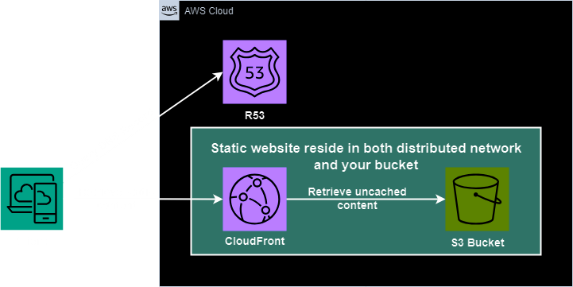

# static-website-with-s3
Infra Code for provisioning static web hosting with s3 bucket behind cdn(cloud front), the infra structure as shown in the bellow diagram.



## Authentication
Use environment variables to specify aws credential
```bash
export AWS_ACCESS_KEY_ID="MYACCESSKEY"
export AWS_SECRET_ACCESS_KEY="MYSECRET"
export AWS_REGION="ap-southeast-2"
```
> Note: if you have aws-cli installed in your envrionment, you don't need to export any credentails.
## Something not covered in Terraform
You have to get the TLS/SSL certificate ready before applying this terraform code.
> Notice: According to the convention of aws, your certified domain name should be the same as the name of your s3 bucket
## How to apply
After exporting credentials to env, run the following command
```bash
# Init terraform local files
terraform init
# Display desired states of resources
terraform plan
# Apply the infra changes
terraform apply
```
## Future Improvement
### Further automation
- The application of SSL certificate can also be automated
- The application of terraform code can be automated and triggered using GitHub Action
  - Use repo secret to store aws credentials and necessary parameters for terrafrom
  - Maybe this goes too far for a demo...
### Security concern
- The bucket access should be restricted.

### Terraform practice
- It is not secure to store terraform backend locally, the state file should be locked in an encrypted bucket.
  - Makes it more secure and less prone to be lost
  - Makes it easier to maintain the infrastructure as a team